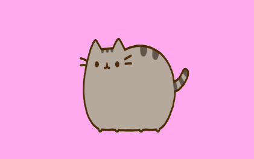

# Miniex3-
Our task this week was to make a throbber. A throbber is something that serves no other purpose than prooving to the user that something is happening/ data is being processed. The traditional throbber/the throbber we come across regularly is some type of shape moving clockwise. Personally I'm sick to death of these kinds of throbbers. I always associate them with a buffering video and waiting, and neither of these things are something that I appreciate. So I decided to make an original throbber, well nothing is original in 2018 but I tried. 

(https://cdn.rawgit.com/CathrineVilain/Miniex3-/e98ee98d/p5/p5/empty-example/index.html)

At first I just knew that I wanted to make something silly and that it should be amusing to watch. So I found a picture of a pusheen cat and animated it using a variable for the x position of the picture. I also used varibales for the speed of the x coordniate. At first the picture just started moving and went out of the frame. Then I used the if function to make it return at a specific x coordinate. In order to make the image move backwards I had to set the speed in minus. Then when it moved back the the other edge i set the speed to be plus again. This makes it go forwards and backwards/ plus and minus forever. I really enjoyed making this unconventional throbber. It is the first animated project and that is really a victory for me. Before making it I was really intimidated by the thought of animating, I didn't think that would be something I could achieve. I know that my program is really simple and ridiculous but I'm quite happe with it. Looking at my program in action makes me feel good because it's fun but also because I made it. 

Visually my throbber is very different from any throbber I've seen. But like any other throbber it provides absolutely no information other than the fact that something is happening. You still have no idea of how long you have to wait, you just know that you're waiting for something that will probably happen eventually. Technically a throbber is useless, It does nothing to aid the program or webpage. It exists solely because of the user. But even so, it does nothing to help us at all. All it does is mislead and annoy us. We haven't the faintest idea of what is actully happening behind the webpage. Instead of just shoving us a throbber, it would be more helpful if they actually gave us some sort of clue of what is actually happening. And if that's not possible, then please entertain us instead of boring us to death. I don't know anything about what happens, but at least my throbber keeps you entertained.  
